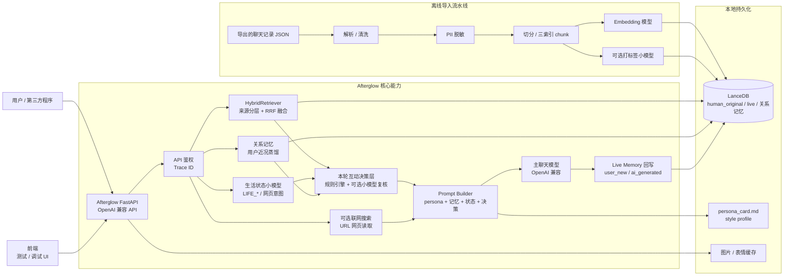
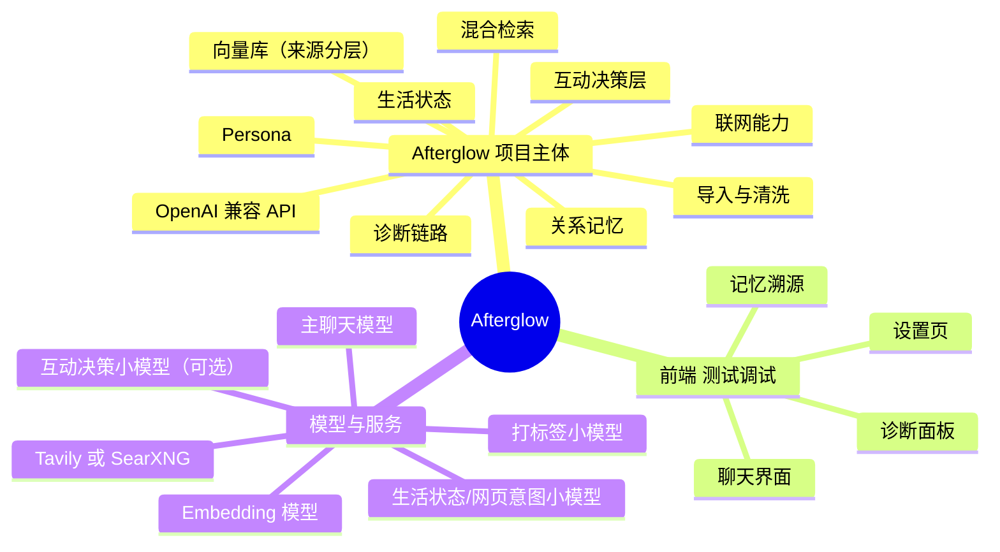

<div align="center">

# 🌅 Afterglow（续温）

> 把曾经对你好的话，续成往后的陪伴。

一个本地运行的「AI 朋友」系统。  
导入真实历史聊天记录，通过 RAG + Persona + OpenAI 兼容 API，让熟悉的人以接近原本的语气继续陪你说话。

</div>

[](#) [](https://afterglow.kldhsh.top/) [](https://github.com/kldhsh123/Afterglow/blob/main/LICENSE) [](https://github.com/kldhsh123/Afterglow/commits/main) [](https://github.com/kldhsh123/Afterglow/releases/latest) 

---

## 🔗 相关项目

- [Afterglow-QQBot](https://github.com/kldhsh123/Afterglow-QQBot) — Afterglow 的 QQBot 适配器

---

## 🎯 项目定位

- **项目主体在 `backend/`**：核心能力都在后端，包括导入、清洗、向量化、LanceDB 存储、检索融合、persona 生成、生活状态、联网检索、网页读取、OpenAI 兼容 API 和调试诊断。
- **`frontend/` 主要用于本地测试和调试体验**：它提供聊天界面、设置页、记忆溯源和诊断入口，方便验证后端能力；第三方程序接入时应优先调用后端 API，而不是依赖前端状态。

## 🙏 致谢

感谢 [LINUX DO](https://linux.do) 各位佬友对项目实现提出的建议，Afterglow 的很多实现细节都来自这些反馈的反复打磨。

Issue 模板参考自一个我已经忘记来源的开源项目；这个模板我认为非常好用。如果你知道原始来源，欢迎联系我，我会补上准确来源和鸣谢。

## 💬 交流与支持

- 项目交流 QQ 群：`330316577`
- 赞助支持：<https://afdian.com/a/kldhsh123>
- 我们的长期合作伙伴 [二次元论坛](https://www.ecylt.top/) 的 [二次元 API 中转站](https://api.223387.xyz/) 提供免费的 Embedding 模型 `Qwen3-Embedding-8B`。对于项目的支持，我们非常感谢。

如果需要使用该 Embedding 模型，请在 `backend/.env` 中修改以下配置，并按服务说明填写对应的 `EMBEDDING_API_URL` / `EMBEDDING_API_KEY`：

```env
EMBEDDING_MODEL=Qwen3-Embedding-8B
EMBEDDING_DIM=4096
EMBEDDING_BATCH_SIZE=25
EMBEDDING_MAX_REQUESTS_PER_MINUTE=100
```

---

## 🔒 数据隐私（必读）

- **请先取得对方同意**：聊天记录高度敏感，包含双方共同产生的私人内容。导出聊天记录、导入本项目、向模型或第三方 API 发送相关文本前，请确认你有权这样做，并尽量取得聊天对方的明确同意。
- **本地持久化**：聊天数据、向量索引、persona 卡片、生活状态和图片缓存都默认保存在你机器上的 `backend/.data/`，仓库不会自带任何远程数据上传逻辑。
- **不是默认零外发**：如果你把模型配置成云端 API，相关文本会发送给对应服务。要做到完全离线，需要把主聊天模型、Embedding 模型、打标小模型、生活状态小模型、视觉模型都指向本地服务，并关闭联网搜索 / 网页读取。
- **可能外发的数据**：
  - 导入时：把清洗后的文本发送给你配置的 **Embedding API**，生成向量后写入本地 LanceDB。
  - 可选打标时：把朋友单条 chunk 发送给你配置的 **Label API**，生成 mood / topic / importance 软标签。
  - 聊天时：把检索到的上下文、persona、生活状态和最近对话发送给你配置的 **主聊天 LLM API**。
  - 生活状态 / 裸域名确认：`LIFE_*` 小模型会收到当前用户消息、少量上下文和候选域名；它只产出 JSON 状态或是否访问 URL 的判断，不直接生成最终回复。
  - 可选联网搜索时：仅在 `WEB_ACCESS_ENABLED=true` 且本轮消息明确要求搜索 / 最新信息时，把查询文本发送给 **Tavily 或 SearXNG**。
  - 可选 URL 读取时：如果消息包含完整链接，且 `WEB_ACCESS_ENABLED=true`、`WEB_FETCH_ENABLED=true`，后端会请求该公开网页并抽取标题 / 正文；裸域名会先经本地意图门控和 `LIFE_*` 小模型确认。
  - 这些 API 由**你**选择、配置并自付费；项目不会内置第三方 key。
- **PII 默认脱敏**：手机号 / 邮箱 / 身份证 / 银行卡 / IP 在入库前自动替换为占位符。QQ 号、URL、域名按设计**保留**（uid 需要匹配、URL 是对话语境的一部分）。
- **`.env` 已在 `.gitignore`**：切勿把含有 API key 的配置文件提交到 git。
- **后端 API 默认需要鉴权**：除 `/healthz` 外，所有接口默认要求 `XUWEN_API_KEY`，避免模型额度、记忆数据和调试信息被滥用。
- **导出 JSON 风险提醒**：[QQChatExporter](https://github.com/shuakami/qq-chat-exporter) / [WeFlow](https://github.com/hicccc77/WeFlow) 等导出工具产出的 JSON 含有完整聊天明文（含 wxid / uid 等账号信息），分享给他人前请自行确认。
- **导出时只勾选纯文本**：Afterglow 只消费文本语料，导出工具一律**关闭图片 / 语音 / 视频 / 文件**等附件选项。这样导出的 JSON 体积小、不含媒体二进制，导入也更快。

---

## 📐 整体架构





### 关键设计

- **三索引混合检索**：response_pairs（用户输入→对方回复）+ 单条朋友发言 + 多轮窗口，RRF 融合。
- **三层时间权重**：近期消息略增（recency boost ±15% 封顶）+ 暖度词加权（warmth boost）+ live/history 信任分层。
- **分层记忆防自污染**：运行时把用户输入标记为 `user_new`，把 AI 分身回复标记为 `ai_generated`。两者都可用于连续性检索，但 `ai_generated` 低权重，且不会参与 persona / 风格蒸馏；真正用于模仿对方语气的长期证据只来自真人原始聊天（`human_original`）。
- **AI 回复长期累积可控**：默认 `AI_GENERATED_LONG_TERM_ENABLED=false`，AI 回复只在同一会话内用于连续性；如果希望 AI 分身随着长期互动形成自己的变化轨迹，可以开启该项，让 `ai_generated` 跨会话参与低权重语义检索。
- **持续生长记忆**：每轮对话都异步回写 `live_messages`，向量库不再是一次性快照。
- **本轮互动决策层**：生成回复前先判断本轮该认真、安抚、撒娇、接梗、转移、沉默、发图还是表情；也会在用户烦躁、崩溃、失眠、关系压力等场景下禁止继续刺激用户。规则引擎兜底安全场景；如果开启 `RESPONSE_POLICY_MODEL_ENABLED`，会再叫一次小模型做有界微调（不能降级 risk、不能撤销规则给的安全/沉默/要图/要表情判断）。
- **沉默与延迟响应**：决策层判断本轮不应回复时直接短路，不调主模型，返回 `finish_reason="silenced"` + sentinel content + `policy.should_reply=false`；生活状态建议的拟人化延迟放在 `policy.reply_delay_seconds`，由客户端决定何时展示。
- **真实时间 + 生活状态**：每次模型调用都会收到当前时区下的真实时间；生活时间线由可配置小模型维护，回答"在干嘛/吃了吗/睡没睡"时优先使用当前状态。
- **可选联网**：后端默认支持 Tavily，也可切到 SearXNG；在明确需要公开实时信息时把网页摘要注入 prompt，默认关闭。
- **零微调**：完全靠 RAG + Prompt Engineering + Persona 卡片，不动模型权重。
- **时光信笺 UI**：米色信笺 + 黛蓝墨痕 + 思源宋体 + 暖光粒子 + 拟人化打字节奏 + 记忆溯源浮窗。

---

## 🚀 快速开始

### 0. 环境要求

| 工具 | 版本 | 用途 | 备注 |
|---|---|---|---|
| Python | ≥ 3.12 | 后端运行时 | 必需 |
| Node.js | ≥ 20 | 前端构建 | **仅用前端时需要**；纯 API 用户可不装 |
| [uv](https://github.com/astral-sh/uv) | latest | Python 包管理 | 推荐 |
| [pnpm](https://pnpm.io/) | latest | Node 包管理 | 仅前端 |
| [QQChatExporter V5](https://github.com/shuakami/qq-chat-exporter) / [WeFlow](https://github.com/hicccc77/WeFlow)（微信，`arkme-json`）导出纯文本 JSON | — | 真人聊天数据源 | 至少一份；plugin 会自动识别格式 |

### 1. 准备模型（API）

Afterglow 不内置模型，所有 LLM 调用都走你自己配置的 OpenAI 兼容服务。下表列出每个角色需要什么样的模型 + 推荐。

| 角色 | 必需？ | 作用 | 推荐 | 配置项 |
|---|---|---|---|---|
| **主聊天模型** | ✅ 必需 | 生成最终回复，决定"像不像 TA" | **DeepSeek** / **Gemini**  | `OPENAI_BASE_URL` `OPENAI_API_KEY` `CHAT_MODEL` |
| **Embedding 模型** | ✅ 必需 | 向量化历史聊天与检索 query | Qwen3-Embedding-8B（阿里云 DashScope 免费额度，或合作伙伴二次元 API 中转站免费提供该模型） | `EMBEDDING_API_URL` `EMBEDDING_API_KEY` `EMBEDDING_MODEL` `EMBEDDING_DIM` |
| **打标小模型** | 🔧 可选 | 给历史 chunk 打 mood / topic / importance 软标签 | **[智谱清言 glm-4-flash](https://www.bigmodel.cn/invite?icode=Q2FUoY2w04wQb%2FoIugMwsA%3D%3D)（免费）** | `LABELING_ENABLED=true` `LABEL_API_*` `LABEL_MODEL` |
| **生活状态 / 网页意图小模型** | 🔧 可选 | 维护 AI 当前在做什么、判断要不要打开 URL | **[智谱清言 glm-4-flash](https://www.bigmodel.cn/invite?icode=Q2FUoY2w04wQb%2FoIugMwsA%3D%3D)（免费）** | `LIFE_API_*` `LIFE_MODEL` |
| **互动决策小模型** | 🔧 可选 | 规则层之后再叫一次小模型微调本轮策略 | **[智谱清言 glm-4-flash](https://www.bigmodel.cn/invite?icode=Q2FUoY2w04wQb%2FoIugMwsA%3D%3D)（免费）** 或复用 LIFE_* | `RESPONSE_POLICY_MODEL_ENABLED=true` `RESPONSE_POLICY_*` |
| **视觉模型** | 🔧 可选 | 主聊天模型不支持视觉时用 VLM 把图转文字 | Qwen-VL / Gemini Vision | `VISION_API_*` `VISION_MODEL` |
| **联网检索** | 🔧 可选 | 用户明确要求"搜索 / 最新 / 天气"时调 | Tavily（月度免费额度）/ 自建 SearXNG | `WEB_ACCESS_ENABLED=true` `WEB_SEARCH_*` |

> **💡 推荐组合（小模型几乎零成本）**
>
> - **主聊天模型**：**DeepSeek** 或 **Gemini**——较高参数量才能撑得起"像 TA 说话"的细腻度
> - **所有小模型**（打标 / 生活状态 / 网页意图 / 互动决策）：**[智谱清言 glm-4-flash](https://www.bigmodel.cn/invite?icode=Q2FUoY2w04wQb%2FoIugMwsA%3D%3D)**——**免费**且性能完全够辅助任务
> - **Embedding**：**Qwen3-Embedding-8B**（DashScope 免费额度 / 二次元 API 中转站 免费）
>
> 这套组合下你的主要花费只在主聊天模型上，其它链路几乎不消耗额度。

### 2. 启动后端

> 接下来所有命令都在 `backend/` 目录下执行。

#### 步骤 ①：安装依赖

```bash
cd backend
uv sync --extra dev
```

#### 步骤 ②：配置 `.env`

```bash
cp .env.example .env
```

用编辑器打开 `.env`，按文件内注释填写：

- **身份信息** —— `SELF_NAME` / `SELF_UID` / `FRIEND_NAME` / `FRIEND_UID`
  - QQ：`SELF_UID` / `FRIEND_UID` 填 QQChatExporter 导出 JSON 里的 `selfUid` / 对方 `sender.uid`（`u_xxx` 形式）
  - 微信：填 WeFlow 导出 JSON 里 `senders[]` 的 `wxid`（`wxid_xxx` 形式）；定位方法见 `backend/README.md`
  - `FRIEND_*` 永远是**你想让 AI 模仿的那个人**，不是你自己
  - **跨平台 / 多账号**：同一个人有多个 UID（QQ + 微信 / 主号 + 小号），直接在 `SELF_UID` / `FRIEND_UID` 里**用逗号分隔**列上所有 UID，导入时会被视为同一身份。例：`FRIEND_UID=u_qq_friend,wxid_friend_main,wxid_friend_alt`
- **主聊天模型** —— `OPENAI_BASE_URL` / `OPENAI_API_KEY` / `CHAT_MODEL`
- **Embedding 模型** —— `EMBEDDING_API_URL` / `EMBEDDING_API_KEY` / `EMBEDDING_MODEL` / `EMBEDDING_DIM` / `EMBEDDING_BATCH_SIZE` / `EMBEDDING_MAX_CONCURRENCY` / `EMBEDDING_MAX_REQUESTS_PER_MINUTE`
- **本地访问密钥** —— `XUWEN_API_KEY`（长随机串；调用方在 Header 带 `Authorization: Bearer <key>`）

> **⚠️ 关键提醒（容易踩的坑）**
>
> - **`API_AUTH_REQUIRED=false` 不会让 `XUWEN_API_KEY` 失效**——只要 KEY 有值就强制校验。想完全开放，请同时把 KEY 留空。
> - **改了 `.env` 必须完全重启后端**——`uvicorn --reload` 只监听 `.py` 文件变化，不会重新加载 `.env`。
> - **客户端请求里的 `model` 字段是占位**——实际使用的永远是 `.env` 配的 `CHAT_MODEL`；传 `gpt-4.1` 或 `gemini-flash` 都会被忽略。

#### 步骤 ③：导入历史聊天

```bash
# 单文件
uv run python -m xuwen.ingestion.cli import 路径/到/你的聊天记录.json

# 多文件（同一个朋友在 QQ + 微信都聊过、或者多个账号）
uv run python -m xuwen.ingestion.cli import qq_导出.json wechat_导出.json 小号_导出.json
```

- CLI 自动按 JSON 顶层特征识别 QQ / WeFlow 格式，**可任意混合**
- 跨平台 / 多账号场景：在 `.env` 用 `SELF_UID=u_qq,wxid_me` 和 `FRIEND_UID=u_qq,wxid_friend`（**逗号分隔**）把全部 UID 列出来
- 多文件按命令行顺序处理，共享 LanceDB 连接与 Embedding 客户端
- 开启 `LABELING_ENABLED=true` 时会接着自动打标
- 中断 / 限流失败不丢导入数据，之后可续跑：`uv run python -m xuwen.ingestion.cli label`

> **⚠️ 多文件场景的两个局限（重要）**
>
> - **作息画像 (`circadian_profile.json`) 仅基于最后一个文件生成**——把数据量最大或最具代表性的对话放在**命令行最后一位**，画像才能反映 TA 真实的作息分布。
> - **下一步 `analyze_persona` 当前也只接受单个 JSON**——多文件场景下，建议挑那个最具代表性的（通常就是同一份"最后一位"文件）单独跑画像。LanceDB 向量库本身是合并的，检索能用上全部数据，但 persona 卡片不会跨文件合并。

#### 步骤 ④：生成 persona 卡片 + 作息画像

```bash
uv run python scripts/analyze_persona.py 路径/到/你的聊天记录.json
```

> **🔍 必做这一步。** 这一步生成四个文件到 `PERSONA_DATA_DIR`：
> - `persona_card.md` — 长期语气画像（prompt 用）
> - `persona_report.json` — 完整统计报告
> - `persona_style_profile.json` — 按话题分桶的风格画像
> - `circadian_profile.json` — TA 的真实作息（识别夜猫子 / 跨时区 / 工作日 vs 周末）
>
> 注意：persona 是离线统计画像，只提供长期语气参考；当天在做什么由 `life_state.json` 和聊天时的小模型状态决定。
>
> **⚠️ 当前只接受单个 JSON 文件。** 如果你在步骤 ③ 导入了多个文件，请挑**数据量最大或最具代表性**的那一份跑 persona——通常就是步骤 ③ 命令行里放在最后一位的那个文件（与 circadian 画像保持一致）。后续会支持多文件合并 persona，欢迎 PR。

#### 步骤 ⑤：启动 chat API

```bash
uv run uvicorn xuwen.chat_api.app:create_app --factory --reload
```

→ 访问 http://127.0.0.1:8000

#### 步骤 ⑥：健康检查

```bash
curl http://127.0.0.1:8000/healthz
curl -H "Authorization: Bearer <XUWEN_API_KEY>" http://127.0.0.1:8000/readyz
```

> `/healthz` 是**唯一不需要鉴权**的端点，可用于容器存活探针。

### 3. 启动前端（可选）

```bash
cd frontend
pnpm install
pnpm dev
```

→ 打开 http://localhost:5173，按引导填写姓名/关系，就可以开始聊天了。

### 4. 不用前端？直接接入 OpenAI 兼容客户端

后端实现 **OpenAI Chat Completions** 和 **OpenAI Responses API** 两套协议，可以接入任何 OpenAI 兼容客户端（Chatbox、Open WebUI、NextChat、ChatGPT Next Web 等）。

```bash
curl -X POST http://127.0.0.1:8000/v1/chat/completions \
  -H "Content-Type: application/json" \
  -H "Authorization: Bearer <XUWEN_API_KEY>" \
  -d '{
    "messages": [{"role": "user", "content": "在吗"}],
    "conversation_id": "my-conv-1"
  }'
```

> **💡 关于 `stream` 字段**
>
> Afterglow 默认**关闭真流式**（`RESPONSE_STREAMING_ENABLED=false`），因为真人发消息从来不是逐字蹦出来的。客户端传 `stream=true` 时仍按 OpenAI SSE 协议返回，但**一次性发完整消息**——OpenAI 兼容性 100% 保留，用户视觉上看到的是"一整条消息突然出现"。

---

## 🎨 自定义人格模板

5 个内置预设：`xuwen`（默认）/ `friend` / `lover` / `family` / `colleague`，在 `.env` 设：

```env
PERSONA_TEMPLATE=lover
```

完全自定义：

```env
PROMPT_TEMPLATE_DIR=/path/to/your/templates
PERSONA_TEMPLATE=my_template
# 会去 /path/to/your/templates/my_template.md.j2 读
```

模板可用变量：`friend_name` / `self_name` / `relationship_description` / `persona_card` / `retrieved_friend_examples` / `retrieved_dialogue_windows` / `recent_conversation` / `current_user_message` / `today` / `current_date` / `current_time` / `current_datetime` / `current_weekday` / `timezone`。其中 `retrieved_friend_examples` 会优先包含 response_pairs 样例。`persona_card` 只应作为长期语气参考，不要当作当天事实来源。

---

## 📁 项目结构

```
Afterglow/
├── backend/                 # Python 后端（FastAPI + LanceDB + RAG）
│   ├── xuwen/
│   │   ├── core/            # 领域模型、错误类型、时间工具
│   │   ├── ingestion/       # 解析、清洗、PII 脱敏、切分、chunking、向量化
│   │   ├── memory/          # LanceDB schema、CRUD、检索融合、回写队列、记忆来源策略
│   │   ├── persona/         # 离线人格画像、prompt 模板（Jinja2）
│   │   ├── companion/       # 生活时间线、关系记忆、本轮互动决策层
│   │   └── chat_api/        # FastAPI 服务（OpenAI 兼容）
│   ├── scripts/             # 离线脚本（导入、画像、检索评估）
│   ├── pyproject.toml
│   └── README.md            # 后端详细文档
│
├── frontend/                # Vue 3 + Vite 前端（时光信笺）
│   ├── src/
│   │   ├── api/             # SSE / fetch 封装
│   │   ├── components/      # chat / memory / common / layout / onboarding
│   │   ├── composables/     # useTypewriter / useAutoScroll / markdown
│   │   ├── stores/          # Pinia: settings / chat / memory
│   │   └── views/           # HomeView / SettingsView
│   ├── tailwind.config.js
│   ├── package.json
│   └── README.md            # 测试/调试前端说明
│
└── 开发缓存/                 # 你的 QQ 导出 JSON（.gitignore）
```

---

## ❓ FAQ

**Q：必须用阿里云 Qwen3-Embedding 吗？**
A：不必，任何 OpenAI 兼容的 `/embeddings` 接口都可以。改 `EMBEDDING_API_URL` / `EMBEDDING_MODEL` / `EMBEDDING_DIM` 即可。本地 ollama 也支持。

**Q：必须用 OpenAI 吗？**
A：不必，任何 OpenAI 兼容的 `/chat/completions` 接口都可以（DeepSeek、Moonshot、Qwen、ollama 等）。改 `OPENAI_BASE_URL` 即可。

**Q：能不能不脱敏 PII？**
A：可以。`.env` 设 `ENABLE_PII_REDACTION=false`，或通过 `PII_RULES_PATH` 加载自定义规则。

**Q：QQ 号 / URL 为什么不脱敏？**
A：QQ 号在导出文件里到处都是（uid 关联需要）；URL 是对话语境的一部分（朋友分享 B 站视频是有意义的）。脱敏列表只覆盖一旦泄漏就造成实质损失的"硬隐私"。

**Q：能否导入微信 / Telegram / Discord 数据？**
A：已内置两个导入 plugin —— [QQChatExporter V5](https://github.com/shuakami/qq-chat-exporter)（QQ）和 [WeFlow](https://github.com/hicccc77/WeFlow) `arkme-json`（微信）。CLI 会按 JSON 顶层特征自动识别，无需额外参数。导出时记得**只勾选纯文本，不要带图片/语音/文件等附件**。其它平台目前没有内置 plugin，但写一个新 plugin 输出 `NormalizedMessage` 即可，下游流水线无需改动，欢迎 PR。

**Q：会不会越聊越不像？**
A：每轮对话都会异步回写到 `live_messages`（`trust_level=0.35`，权重远低于历史 `1.0`）。前端可在设置页"暂停回写"避免污染。

**Q：怎么删除某条记忆？**
A：调 `DELETE /memory/friend_messages/{chunk_id}` 或 `DELETE /memory/response_pairs/{pair_id}`（软删除）。

**Q：能本地完全离线吗？**
A：可以。LLM 用 ollama / vLLM；embedding 用 `nomic-embed-text` / `bge` 等本地模型。

---

## 🛠️ 开发

```bash
# 后端
cd backend

# 前端
cd frontend
pnpm dev                        # 开发服务器
pnpm build                      # 类型检查 + 生产构建
```

更多文档：

- [后端 API 文档](docs/API.md)
- [开发文档](docs/DEVELOPMENT.md)

---

## 📜 License

AGPL-3.0-or-later

---

<div align="center">

### ⭐ Star History

<picture>
  <source
    media="(prefers-color-scheme: dark)"
    srcset="https://api.star-history.com/svg?repos=kldhsh123/Afterglow&type=Date&theme=dark"
  />
  <source
    media="(prefers-color-scheme: light)"
    srcset="https://api.star-history.com/svg?repos=kldhsh123/Afterglow&type=Date"
  />
  
</picture>

<sub>如果 Afterglow 帮你留住了一些温度，欢迎点一颗 ⭐。</sub>

</div>
