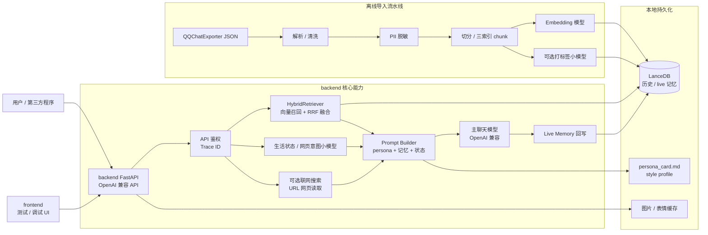
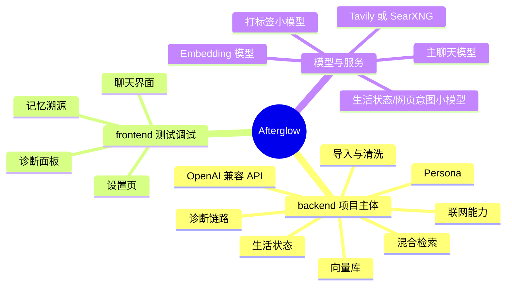

# Afterglow（续温）

> 把曾经对你好的话，续成往后的陪伴。

**Afterglow** 是一个本地运行的"AI 朋友"系统：把你和朋友（或恋人、亲人、同事）的真实历史聊天记录导入向量库，配合 LLM 用 RAG 让对方"继续陪你说话"——语气、用词、节奏都贴近真实的他/她。
当你想念某个不太能联系的人，可以在这里再读到他熟悉的语气。

---

## 项目定位

- **项目主体在 `backend/`**：核心能力都在后端，包括导入、清洗、向量化、LanceDB 存储、检索融合、persona 生成、生活状态、联网检索、网页读取、OpenAI 兼容 API 和调试诊断。
- **`frontend/` 主要用于本地测试和调试体验**：它提供聊天界面、设置页、记忆溯源和诊断入口，方便验证后端能力；第三方程序接入时应优先调用后端 API，而不是依赖前端状态。

## 致谢

感谢 [LINUX DO](linux.do) 各位佬友对项目实现提出的建议，Afterglow 的很多实现细节都来自这些反馈的反复打磨。

Issue 模板参考自一个我已经忘记来源的开源项目；这个模板我认为非常好用。如果你知道原始来源，欢迎联系我，我会补上准确来源和鸣谢。

---

## 🔒 数据隐私（必读）

- **本地持久化**：聊天数据、向量索引、persona 卡片、生活状态和图片缓存都默认保存在你机器上的 `backend/.data/`，仓库不会自带任何远程数据上传逻辑。
- **不是默认零外发**：如果你把模型配置成云端 API，相关文本会发送给对应服务。要做到完全离线，需要把主聊天模型、Embedding 模型、打标小模型、生活状态小模型、视觉模型都指向本地服务，并关闭联网搜索 / 网页读取。
- **可能外发的数据**：
  - 导入时：把清洗后的文本发送给你配置的 **Embedding API**，生成向量后写入本地 LanceDB。
  - 可选打标时：把朋友单条 chunk 发送给你配置的 **Label API**，生成 mood / topic / importance 软标签。
  - 聊天时：把检索到的上下文、persona、生活状态和最近对话发送给你配置的 **主聊天 LLM API**。
  - 生活状态 / 裸域名确认：`LIFE_*` 小模型会收到当前用户消息、少量上下文和候选域名；它只产出 JSON 状态或是否访问 URL 的判断，不直接生成最终回复。
  - 可选联网搜索时：仅在 `WEB_ACCESS_ENABLED=true` 且本轮消息明确要求搜索 / 最新信息时，把查询文本发送给 **Tavily 或 SearXNG**。
  - 可选 URL 读取时：如果消息包含完整链接，且 `WEB_ACCESS_ENABLED=true`、`WEB_FETCH_ENABLED=true`，后端会请求该公开网页并抽取标题 / 正文；裸域名会先经本地意图门控和 `LIFE_*` 小模型确认。
  - 这些 API 由**你**选择、配置并自付费；项目不会内置第三方 key。
- **PII 默认脱敏**：手机号 / 邮箱 / 身份证 / 银行卡 / IP 在入库前自动替换为占位符。QQ 号、URL、域名按设计**保留**（uid 需要匹配、URL 是对话语境的一部分）。
- **`.env` 已在 `.gitignore`**：切勿把含有 API key 的配置文件提交到 git。
- **后端 API 默认需要鉴权**：除 `/healthz` 外，所有接口默认要求 `XUWEN_API_KEY`，避免模型额度、记忆数据和调试信息被滥用。
- **导出 JSON 风险提醒**：QQChatExporter 导出的 JSON 含有完整聊天明文，分享给他人前请自行确认。

---

## 📐 整体架构





### 关键设计

- **三索引混合检索**：response_pairs（用户输入→对方回复）+ 单条朋友发言 + 多轮窗口，RRF 融合。
- **三层时间权重**：近期消息略增（recency boost ±15% 封顶）+ 暖度词加权（warmth boost）+ live/history 信任分层。
- **持续生长记忆**：每轮对话都异步回写 `live_messages`，向量库不再是一次性快照。
- **真实时间 + 生活状态**：每次模型调用都会收到当前时区下的真实时间；生活时间线由可配置小模型维护，回答“在干嘛/吃了吗/睡没睡”时优先使用当前状态。
- **可选联网**：后端默认支持 Tavily，也可切到 SearXNG；在明确需要公开实时信息时把网页摘要注入 prompt，默认关闭。
- **零微调**：完全靠 RAG + Prompt Engineering + Persona 卡片，不动模型权重。
- **时光信笺 UI**：米色信笺 + 黛蓝墨痕 + 思源宋体 + 暖光粒子 + 拟人化打字节奏 + 记忆溯源浮窗。

---

## 🚀 快速开始

需要：
- Python ≥ 3.12
- Node ≥ 20（前端可选；纯 API 用户可不装）
- [uv](https://github.com/astral-sh/uv)、[pnpm](https://pnpm.io/)（推荐）
- 一份 [QQChatExporter V5](https://github.com/shuakami/qq-chat-exporter) 导出的 JSON
- 至少准备一个主聊天模型 API 和一个 Embedding 模型 API

### 部署需要准备什么

必需：

- **主聊天模型**：OpenAI 兼容 `/chat/completions`，用于最终回复。配置 `OPENAI_BASE_URL`、`OPENAI_API_KEY`、`CHAT_MODEL`。
- **Embedding / 向量模型**：OpenAI 兼容 `/embeddings`，用于导入历史、检索和 live memory 回写。配置 `EMBEDDING_API_URL`、`EMBEDDING_API_KEY`、`EMBEDDING_MODEL`、`EMBEDDING_DIM`。
- **本地存储目录**：默认 `.data/lancedb`、`.data/persona`、`.data/images`，用于 LanceDB、persona 文件和图片缓存。
- **后端访问密钥**：配置 `XUWEN_API_KEY`。所有非 `/healthz` 接口默认都需要 `Authorization: Bearer <key>` 或 `x-api-key`。

可选但推荐：

- **打标签小模型**：OpenAI 兼容 `/chat/completions`，用于首次导入后给 chunk 打 mood / topic / importance。配置 `LABELING_ENABLED=true`、`LABEL_API_URL`、`LABEL_API_KEY`、`LABEL_MODEL`。可以用便宜快的小模型。
- **生活状态 / 网页意图小模型**：OpenAI 兼容 `/chat/completions`，通过 `LIFE_API_URL`、`LIFE_API_KEY`、`LIFE_MODEL` 配置。它负责维护 AI “现在在做什么 / 是否方便回复 / 下一次更新时间”，也负责在用户只写裸域名时确认是否需要访问网页。这两件事可以用同一个小模型；留空则复用主聊天模型。
- **联网搜索服务**：可选 Tavily 或自建 SearXNG。只有 `WEB_ACCESS_ENABLED=true` 且用户明确要求搜索、新闻、天气、价格等实时公开信息时才会调用。
- **视觉模型**：如果要处理图片且主聊天模型不支持视觉，需要配置 `VISION_API_URL`、`VISION_API_KEY`、`VISION_MODEL`。

### 1. 后端

```bash
cd backend

# 安装依赖
uv sync --extra dev

# 配置
cp .env.example .env
# 用编辑器打开 .env，按文件内注释填写 SELF_* / FRIEND_*、模型 key 和 XUWEN_API_KEY。

# 导入历史聊天
uv run python -m xuwen.ingestion.cli import 路径/到/你的_qq_export.json
# 如果开启了 LABELING_ENABLED=true，导入完成后会继续跑打标阶段。
# 中断或限流失败也不会丢导入数据，之后可手动续跑：
# uv run python -m xuwen.ingestion.cli label

# 生成 persona 卡片与场景风格画像（必做，否则 prompt 缺乏画像信息）
# 注意：persona 是离线统计画像，只提供长期语气参考；
# 当天在做什么、吃了什么、是否方便回复由 life_state.json 和聊天时的小模型状态决定。
# 该命令会同时生成 persona_card.md / persona_report.json / persona_style_profile.json。
uv run python scripts/analyze_persona.py 路径/到/你的_qq_export.json

# 启动 chat API
uv run uvicorn xuwen.chat_api.app:create_app --factory --reload
# → http://127.0.0.1:8000

# 健康检查
curl http://127.0.0.1:8000/healthz
curl -H "Authorization: Bearer <XUWEN_API_KEY>" http://127.0.0.1:8000/readyz
```

### 2. 前端

```bash
cd frontend
pnpm install
pnpm dev
# → http://localhost:5173
```

打开浏览器，按引导填写姓名/关系，就可以开始聊天了。

### 3. 不用前端？直接调 API

后端是 **OpenAI 兼容**的 `/v1/chat/completions`，可以接入任何 OpenAI 客户端（Chatbox、Open WebUI、NextChat 等）。

```bash
curl -X POST http://127.0.0.1:8000/v1/chat/completions \
  -H "Content-Type: application/json" \
  -d '{
    "model": "gpt-4o-mini",
    "messages": [{"role": "user", "content": "在吗"}],
    "stream": true,
    "conversation_id": "my-conv-1"
  }'
```

---

## 🎨 自定义人格模板

5 个内置预设：`xuwen`（默认）/ `friend` / `lover` / `family` / `colleague`，在 `.env` 设：

```env
PERSONA_TEMPLATE=lover
```

完全自定义：

```env
PROMPT_TEMPLATE_DIR=/path/to/your/templates
PERSONA_TEMPLATE=my_template
# 会去 /path/to/your/templates/my_template.md.j2 读
```

模板可用变量：`friend_name` / `self_name` / `relationship_description` / `persona_card` / `retrieved_friend_examples` / `retrieved_dialogue_windows` / `recent_conversation` / `current_user_message` / `today` / `current_date` / `current_time` / `current_datetime` / `current_weekday` / `timezone`。其中 `retrieved_friend_examples` 会优先包含 response_pairs 样例。`persona_card` 只应作为长期语气参考，不要当作当天事实来源。

---

## 📁 项目结构

```
Afterglow/
├── backend/                 # Python 后端（FastAPI + LanceDB + RAG）
│   ├── xuwen/
│   │   ├── core/            # 领域模型、错误类型、时间工具
│   │   ├── ingestion/       # 解析、清洗、PII 脱敏、切分、chunking、向量化
│   │   ├── memory/          # LanceDB schema、CRUD、检索融合、回写队列
│   │   ├── persona/         # 离线人格画像、prompt 模板（Jinja2）
│   │   └── chat_api/        # FastAPI 服务（OpenAI 兼容）
│   ├── scripts/             # 离线脚本（导入、画像、检索评估）
│   ├── pyproject.toml
│   └── README.md            # 后端详细文档
│
├── frontend/                # Vue 3 + Vite 前端（时光信笺）
│   ├── src/
│   │   ├── api/             # SSE / fetch 封装
│   │   ├── components/      # chat / memory / common / layout / onboarding
│   │   ├── composables/     # useTypewriter / useAutoScroll / markdown
│   │   ├── stores/          # Pinia: settings / chat / memory
│   │   └── views/           # HomeView / SettingsView
│   ├── tailwind.config.js
│   ├── package.json
│   └── README.md            # 测试/调试前端说明
│
└── 开发缓存/                 # 你的 QQ 导出 JSON（.gitignore）
```

---

## ❓ FAQ

**Q：必须用阿里云 Qwen3-Embedding 吗？**
A：不必，任何 OpenAI 兼容的 `/embeddings` 接口都可以。改 `EMBEDDING_API_URL` / `EMBEDDING_MODEL` / `EMBEDDING_DIM` 即可。本地 ollama 也支持。

**Q：必须用 OpenAI 吗？**
A：不必，任何 OpenAI 兼容的 `/chat/completions` 接口都可以（DeepSeek、Moonshot、Qwen、ollama 等）。改 `OPENAI_BASE_URL` 即可。

**Q：能不能不脱敏 PII？**
A：可以。`.env` 设 `ENABLE_PII_REDACTION=false`，或通过 `PII_RULES_PATH` 加载自定义规则。

**Q：QQ 号 / URL 为什么不脱敏？**
A：QQ 号在导出文件里到处都是（uid 关联需要）；URL 是对话语境的一部分（朋友分享 B 站视频是有意义的）。脱敏列表只覆盖一旦泄漏就造成实质损失的"硬隐私"。

**Q：能否导入微信 / Telegram / Discord 数据？**
A：当前只支持 QQChatExporter V5 的 JSON 格式，并且短时间内不会支持其他平台，您可以提出PR来帮助我们。要支持其它来源，写一个新 parser 输出 `NormalizedMessage` 即可，下游流水线无需改动。

**Q：会不会越聊越不像？**
A：每轮对话都会异步回写到 `live_messages`（`trust_level=0.35`，权重远低于历史 `1.0`）。前端可在设置页"暂停回写"避免污染。

**Q：怎么删除某条记忆？**
A：调 `DELETE /memory/friend_messages/{chunk_id}` 或 `DELETE /memory/response_pairs/{pair_id}`（软删除）。

**Q：能本地完全离线吗？**
A：可以。LLM 用 ollama / vLLM；embedding 用 `nomic-embed-text` / `bge` 等本地模型。

---

## 🛠️ 开发

```bash
# 后端
cd backend
uv run pytest                  # 跑测试
uv run ruff check xuwen/        # lint
uv run mypy xuwen/              # 类型检查

# 前端
cd frontend
pnpm dev                        # 开发服务器
pnpm build                      # 类型检查 + 生产构建
```

更多文档：

- [后端 API 文档](docs/API.md)
- [开发文档](docs/DEVELOPMENT.md)

---

## 📜 License

AGPL-3.0-or-later
